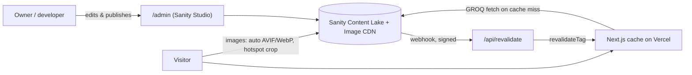
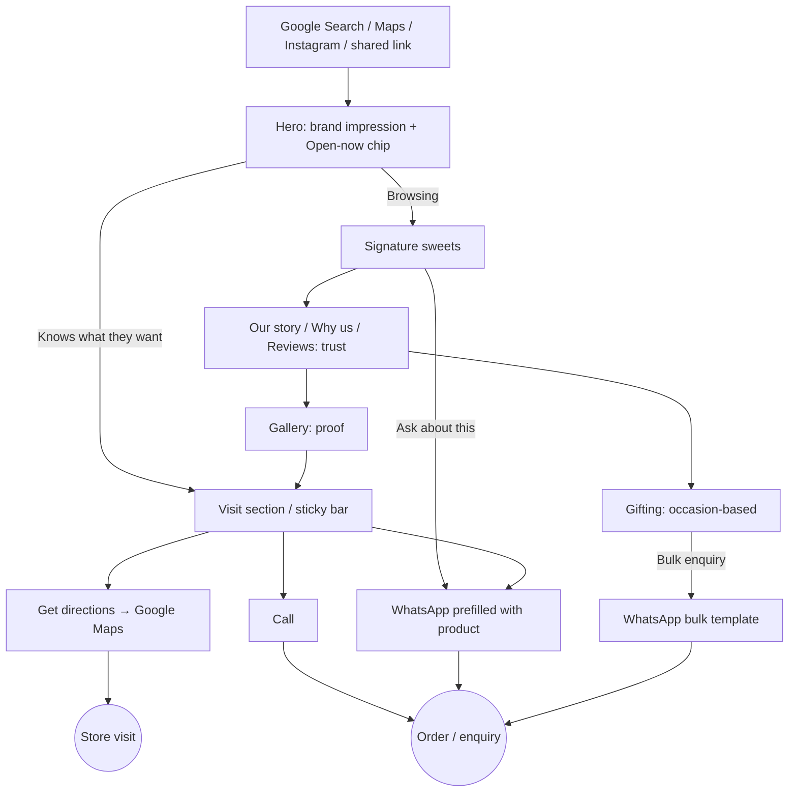

# Sri Shakti Sweets — Website Project Plan

> **Status:** Draft v2 · awaiting approval · prepared 4 Oct 2026
> **v2.2 (4 Oct 2026):** the client supplied the real logo (navy "SS" monogram with a red frame), the email srishaktisweets@yahoo.in and a second shop: 38/4, Sardar Complex, 7th 'A' Cross, Magadi Road, near Anjan Theatre, Bengaluru 560023, ph. +91 74066 00747 (hours not yet known). The monogram has been vector-traced (`src/components/ui/logo-paths.ts`). The signboard cartouche in §4.7 is superseded.
> **v2.1:** the client confirmed the address and the logo (signboard) on 4 Oct 2026.
> **v2 changes:** an **admin panel** is now in scope (§10.6, Phase 1B); the logo and first photos have been received and audited (§2.4, §8.5); a logo and brand-colour note has been added (§4.7).
> **Purpose:** The single source of truth for designing and building the Sri Shakti Sweets brand website. Future build sessions should follow this document and only revisit a decision when the plan is formally changed.

**Legend used throughout**

| Tag | Meaning |
|---|---|
| ✅ **VERIFIED** | Confirmed from the client's Google link itself |
| 🟡 **UNCONFIRMED** | Found on third-party sites. It probably refers to this shop, but the owner must confirm it |
| 🔲 **PLACEHOLDER** | Not known. Must be supplied by the owner before launch |
| 💡 **ASSUMPTION** | A planning assumption. Change it if it turns out to be wrong |

---

## Contents

1. Executive summary
2. Business analysis
3. Website goals and target audience
4. Creative direction and visual identity
5. Design inspiration and references
6. Sitemap and section architecture
7. Detailed UI/UX specifications
8. Photography and asset requirements
9. Animation and 3D strategy
10. Technical stack and architecture
11. Functionality and customer journey
12. Performance, SEO and accessibility
13. Mobile-first strategy
14. Phased development roadmap
15. Testing and quality assurance
16. Client information checklist
17. Risk assessment and scope control
18. Definition of done

---

## 1. Executive summary

Sri Shakti Sweets needs a **premium, fast, mobile-first brand website**. It should present the shop as a destination for Indian sweets and convert visitors into **WhatsApp enquiries, phone calls and store visits**. It is a marketing showcase, **not an e-commerce store**: no cart, checkout or payments. It includes a **password-protected admin panel at `/admin`**, where photos, products, hours, contact details, story, gifting, reviews and the seasonal banner can be edited without touching code. The panel is powered by a hosted headless CMS (Sanity), so there is still no server or database of our own to maintain.

**Recommended direction: "Warm Editorial Sweets".** The site uses a warm ghee-cream canvas, deep cocoa ink and a single saffron accent, with large editorial serif headlines and generous whitespace. Product photography carries the page, and motion stays slow and restrained. Indian heritage shows through material cues: paper textures, a fine line motif from traditional sweet-box borders, and an optional regional-script accent. It does not rely on maroon and gold ornament. The aim is a site that feels closer to a premium patisserie than to a typical local sweet-shop listing.

**Recommended build:** one long-scroll home page (with routes reserved for a later `/menu` page). It uses **Next.js 16 (App Router) + TypeScript + Tailwind CSS v4 + Motion** (the `motion` package is already installed in this folder), with **Sanity Studio embedded at `/admin`** for content. Shop details, products, gallery and reviews are CMS documents with typed schemas and validation, so swapping placeholders never touches components. Publishing in the admin updates the live site within seconds (on-demand revalidation). The site is hosted on Vercel. 3D is **not** in the first release. It is an optional later enhancement.

**First step:** Phase 0 confirms the business identity (see §2.1; this is the main open risk) and collects assets. Phase 1 scaffolds the project and design tokens, and Phase 1B sets up the admin panel.

---

## 2. Business analysis

### 2.1 What the Google link actually shows

| Item | Finding | Status |
|---|---|---|
| Link | `share.google/pt83rt9uZGji7Nte7` redirects to a Google Search knowledge panel: `kgmid=/g/1tcz6r_6`, `q=Sri+Shakti+Sweets`, `hl=en-IN` | ✅ VERIFIED |
| Business name | **Sri Shakti Sweets**. The client brief says "Shakti Sweets", but Google lists **"Sri"** | ✅ VERIFIED |
| Everything else | Google does not return the panel contents (address, photos, hours, reviews) to automated requests, so none of it could be read directly | ⚠️ NOT ACCESSIBLE |

### 2.2 Business identity (address confirmed by the client on 4 Oct 2026)

Many unrelated shops in India are called "Shakti Sweets" (Srinagar, Ahmedabad, Surat, Shamli and others). **The only listing found with the exact name "Sri Shakti Sweets" is in Bengaluru:**

| Item | Third-party data | Source | Status |
|---|---|---|---|
| Address | **23/1-1, Sri Shakti Tower, Ground Floor, 1st Main Rd, Okalipuram, Bengaluru, Karnataka 560021** (Zomato listed "5th Main Road"; use the client-supplied version) | Client, 4 Oct 2026 | ✅ **CONFIRMED by client** |
| Category | Mithai, street food (Zomato); sweet shop | Zomato | 🟡 UNCONFIRMED |
| Hours | 8 am – 10 pm | Zomato (via search summary) | 🟡 UNCONFIRMED, may be outdated |
| Phone | +91 80 2312 1869, +91 93412 22517 | Zomato (via search summary) | 🟡 UNCONFIRMED |
| Price level | about ₹150 for two | Zomato | 🟡 UNCONFIRMED |
| Payment | Cash and cards | Zomato | 🟡 UNCONFIRMED |
| Rating | 3.9 from only 9 dining ratings | Zomato | 🟡 Too small a sample. **Do not display** |
| Landmark | A Justdial listing for a nearby business uses "Shakthi Sweets, near Okalipuram" as a landmark, which suggests a long-standing local presence | Justdial | 🟡 Indirect |

> **Status:** the identity is **confirmed as the Okalipuram, Bengaluru shop** (address supplied by the client). Bengaluru-specific choices (Kannada script accent, local SEO terms) are therefore valid. The other 🟡 rows (hours, phones, category, payment) still need the owner's confirmation before launch.

### 2.3 Not found and never to be invented

None of the following could be verified: founding year or history, product list, signature items, ingredients (pure ghee, no preservatives and so on), awards, press, reviews or testimonials, logo or brand colours, social media accounts, gifting or catering services, delivery, branches. **All of these come from the owner (§16).** The site must not state or imply any of them until supplied.

### 2.4 Assets received from the client (4 Oct 2026)

Stored in `assets-src/client-provided/`.

| What it shows | Finding | Status |
|---|---|---|
| **Signboard / logo photo** (`logo-signboard-photo.png`, 547×180; the client confirmed on 4 Oct 2026 that this is the logo) | Reads **"SRI SHAKTI SWEETS"** with the subline **"SWEETS & SNACKS"**: dark navy serif capitals on a cream oval with a thin gold-and-red outline, on a red-to-pink background | ✅ Name confirmed as **Sri Shakti Sweets**. ✅ The shop describes itself as **"Sweets & Snacks"** |
| Product photos | See the audit in §8.5 | Mixed (one may be real, four are Getty/iStock stock previews) |

This makes the Okalipuram identity in §2.2 more likely (same exact name), but it is **still unconfirmed** until the owner confirms the address.

### 2.5 Positioning hypotheses (to validate with the owner)

- 💡 It is a neighbourhood sweet shop in a dense commercial and residential area near Majestic. Visitors are likely footfall-driven, regular and festival shoppers.
- ✅ The signboard says "Sweets & Snacks", so **Sweets** and **Snacks** are safe top-level categories. 💡 It probably sells a mix of South and North Indian mithai. **Do not publish specific items until the owner confirms them.**
- 💡 Festival seasons (Deepavali, Ugadi, Sankranti, Ganesha Chaturthi, Raksha Bandhan) and wedding or function orders are likely revenue peaks. The gifting section is built but **hidden by a config flag** until the owner confirms they offer it.

---

## 3. Website goals and target audience

### 3.1 Objectives

| Priority | Goal | Measured by (if analytics are added) |
|---|---|---|
| Primary | Generate enquiries (WhatsApp and phone) | Clicks on `wa.me` and `tel:` links |
| Primary | Drive store visits | Clicks on the "Get directions" link |
| Secondary | Build a memorable, trustworthy brand presence | Time on page, scroll depth, direct and brand searches |
| Secondary | Showcase sweets and gifting | Product card interactions, gallery opens |
| Secondary | Capture festive, wedding and bulk orders | Clicks on the bulk-enquiry WhatsApp link |
| Supporting | Rank for local searches ("sweet shop Okalipuram", "sweets near Majestic") | Search Console impressions |

### 3.2 Audiences

| Segment | Need | Behaviour | Key action |
|---|---|---|---|
| Local regulars and nearby residents | Hours, what's fresh, quick contact | Mobile, short visits, often from Google Maps or Search | Call, directions |
| Festival shoppers | What boxes or assortments exist, whether pre-ordering is possible | Mobile, seasonal spikes, comparing shops | WhatsApp enquiry |
| Wedding and function planners | Bulk quantities, custom boxes, reliability | Researching, may share the link with family | Bulk WhatsApp enquiry, call |
| Corporate and office buyers | Gift boxes in quantity, invoices | Desktop during work hours | WhatsApp or call |
| Commuters and visitors near Majestic | Is it open now, how to get there | Mobile, urgent | Directions |

**Design implication:** fewer than 10 seconds to find hours, location and contact on mobile. Everything else is the brand experience that makes them choose this shop.

---

## 4. Creative direction and visual identity

### 4.1 Concept: "Warm Editorial Sweets"

*Heritage felt through material, not ornament.* Think of a beautifully printed sweet-shop catalogue: warm paper, confident serif type, one glowing saffron accent, and sweets photographed like jewellery on calm surfaces. Indian character comes from:

- **Materials:** warm paper grain, brass-and-ghee warmth in lighting, banana-leaf green as a secondary hue
- **Line motif:** one fine, repeating border based on the scalloped and stepped edges of traditional sweet boxes and kolam dots. It is used as a thin divider or frame, never as a full background
- **Script accent (💡 if Bengaluru is confirmed):** one Kannada word per section as a small, quiet label, e.g. ಸಿಹಿ (*sihi*, "sweet"). Copy must be checked by a native speaker
- **Language of the craft:** section titles such as "Made the slow way" or "From our kitchen". These need owner input before claiming anything specific

**Why it fits:** it signals quality and care, which supports premium perception and gifting. The look stays timeless rather than tied to festivals, so the site does not date after Diwali. Avoiding the maroon-gold-mandala cliché is what sets it apart from almost every local competitor.

**Brand personality:** warm, generous, proud of craft, quietly confident, welcoming to everyone.
**Tone of voice:** short, sensory, friendly. Second person ("Drop by", "Ask us about…"). No superlatives that cannot be proven ("best in Bangalore", "purest"). Bilingual touches only where verified.

### 4.2 Colour system

All text pairings meet WCAG 2.2 AA (contrast values were computed, not estimated).

| Token | Name | HEX | Use | Contrast |
|---|---|---|---|---|
| `--color-cream` | Ghee Cream | `#FAF6EE` | Main page background | — |
| `--color-paper` | Barfi Paper | `#F2EBDD` | Alternate sections, cards | — |
| `--color-ink` | Cocoa Ink | `#211A16` | Headings, body text | 15.9:1 on cream |
| `--color-muted` | Jaggery | `#6B5E54` | Secondary text, captions | 5.8:1 on cream, 5.3:1 on paper |
| `--color-saffron` | Kesar | `#E39B2D` | **Accent fills only:** primary button background, highlights, underline strokes | Ink on saffron 7.4:1. ⚠️ Never use as text on cream (2.2:1) |
| `--color-saffron-deep` | Kesar Deep | `#9C5209` | Accent **text** and links on light backgrounds | 5.4:1 on cream, 4.9:1 on paper |
| `--color-pista` | Pista | `#5E6E3A` | Secondary accent (tags, badges, "veg" marks, leaf motif) | 5.2:1 on cream |
| `--color-rose` | Gulkand | `#A1463C` | Rare tertiary accent (festive or gifting labels only) | 5.6:1 on cream |
| `--color-night` | Kesar Night | `#2B211C` | One or two dark "moment" sections (story, final CTA) and the footer | Cream text 14.6:1 |
| `--color-night-muted` | — | `#CBBFAF` | Secondary text on night | 8.7:1 |
| `--color-saffron` on night | — | `#E39B2D` | Accent text on dark sections | 6.7:1 |

**Ratio of use:** about 70% cream/paper, 20% ink/night, 8% photography colour, **2% saffron**. Saffron appears no more than once or twice per viewport. Pista and rose are seasonings, not main colours. No gold gradients, no maroon backgrounds.

**WhatsApp button:** keep the brand saffron button with the WhatsApp glyph rather than WhatsApp green (`#25D366`). The icon alone is recognisable, and green would clash with the palette.

### 4.3 Typography

| Role | Font | Why | Loading |
|---|---|---|---|
| Display and headings | **Fraunces** (variable; axes: weight, optical size, SOFT, WONK). Use opsz high and SOFT ≈ 50–100 for warm, slightly rounded display cuts | An editorial serif with warmth and a little wit. Feels crafted, not corporate | `next/font/google`, variable, Latin subset |
| Body and UI | **Manrope** (variable 400–700) | Clean and friendly, highly legible on small screens, pairs well with soft serifs | `next/font/google`, Latin subset |
| Script accent (💡) | **Noto Serif Kannada** (400) | Matches Fraunces' serif feel. Used for 1–3 words per section only | `next/font/google`, `display: optional`, subset only if confirmed |

**Fluid type scale** (1.25 ratio on mobile → 1.333 on desktop, implemented with `clamp()`)

| Token | Mobile → Desktop | Font / weight / tracking | Use |
|---|---|---|---|
| `display` | 44px → 104px | Fraunces 400, opsz 144, −2% | Hero headline only |
| `h1` | 36px → 72px | Fraunces 400, −1.5% | Section showpiece titles |
| `h2` | 30px → 52px | Fraunces 400, −1% | Section titles |
| `h3` | 22px → 28px | Fraunces 500 | Card titles |
| `eyebrow` | 12px → 13px | Manrope 600, UPPERCASE, +12% | Labels above titles |
| `lead` | 18px → 22px | Manrope 400, line-height 1.55 | Intro paragraphs |
| `body` | 16px → 17px | Manrope 400, line-height 1.65 | Body text (never below 16px on mobile) |
| `small` | 14px | Manrope 500 | Captions, meta |

Rules: maximum line length 65ch. Headings are sentence case. Italic Fraunces may set one emphasised word per headline (e.g. "Sweets made *slowly*").

### 4.4 Spacing, grid and layout

- **Base unit:** 4px. Scale tokens: 4, 8, 12, 16, 24, 32, 48, 64, 96, 128, 160.
- **Section vertical rhythm:** `clamp(80px, 12vw, 160px)` top and bottom.
- **Container:** maximum 1320px content width. Side gutters are 20px (mobile), 32px (tablet) and 48px (desktop). Full-bleed imagery may ignore the container.
- **Grid:** 4 columns (mobile) / 8 (tablet ≥ 768px) / 12 (desktop ≥ 1024px). Gap is 16 / 24 / 32px.
- **Breakpoints:** `sm 640`, `md 768`, `lg 1024`, `xl 1280`, `2xl 1536`.
- **Compositions:** asymmetric editorial layouts (e.g. text in columns 1–5, image in 7–12, offset vertically). At most one centred section per three sections, to keep rhythm.

### 4.5 Component treatments

| Element | Treatment |
|---|---|
| **Primary button** | Saffron fill, ink text, Manrope 600 16px, height 52px (mobile) / 48px (desktop), radius 999px (pill), padding 0 28px. Hover: background darkens 6% and the arrow nudges 4px. Focus: 2px ink outline, 3px offset. Active: scale 0.98 |
| **Secondary button** | Transparent, 1px ink border, ink text, same size. Hover: ink fill, cream text |
| **Text link** | Saffron-deep text with an animated underline drawn left to right on hover (1px → 2px) |
| **Product card** | No border. Image at 4:5 with radius 20px. Title (h3) and one-line description below. Optional pista "tag" chip. Hover (pointer devices only): image scales 1.04 over 700ms, a second "detail" image cross-fades if supplied, and the "Ask about this →" link reveals |
| **Section frame** | The fine line motif (1px, `--color-ink` at 15% opacity) as a top divider on some sections |
| **Navigation** | Transparent over the hero. After 80px of scroll it becomes a cream bar with 85% opacity and a 12px backdrop blur, height 64px |
| **Corners** | Radius scale: 8 (chips), 20 (cards and images), 32 (large feature images), 999 (buttons) |
| **Shadows** | Almost none. One soft, warm shadow token for floating elements (mobile action bar, lightbox): `0 12px 40px -12px rgb(43 33 28 / 0.25)` |
| **Borders** | 1px `rgb(33 26 22 / 0.12)` hairlines |
| **Texture** | A subtle paper-grain overlay (tiny tiled WebP, 3–4% opacity) on paper and night sections only |
| **Icons** | **Lucide** at 1.5px stroke, 20/24px, ink colour. Brand glyphs (WhatsApp, Instagram) as inline SVGs to match the stroke style |
| **Decorative elements** | (1) the box-edge line motif, (2) a small hand-drawn style saffron-strand flourish used no more than 3 times on the page, (3) dotted kolam corner marks on the story and gifting frames |

### 4.6 Photography art direction

- **Light:** warm, directional natural light (window light from the left) with soft shadows. Never flat flash.
- **Surfaces:** stone, brass plates, banana leaf, linen, kraft or handmade paper. One neutral surface per shoot for consistency.
- **Composition:** generous negative space (space for type), 3/4 angle or straight overhead, with shallow depth of field for hero shots.
- **Colour grade:** warm highlights, slightly lifted shadows, true food colour (never over-saturated).
- **Story shots:** hands shaping, ghee pouring, syrup texture, stacking boxes. These must be real shop footage.
- **Avoid:** cluttered festive props, generic stock diya-and-rangoli shots, cut-out PNGs on white.

### 4.7 Logo and existing brand colours

- **What exists:** only a **photo of the shop signboard** (547×180, perspective, compression artefacts). It cannot be used on the web as it is: it would look blurry and off-brand.
- **Plan:** **redraw the signboard logo as a clean vector** (SVG). Keep what customers recognise: the "SRI SHAKTI SWEETS" serif capitals, the "SWEETS & SNACKS" subline and the oval cartouche. Tidy the spacing and set the curves accurately. Deliver it in four versions: full colour, mono ink, mono cream (for dark sections) and a compact "SSS" monogram for the favicon and app icon. **The owner approves it before use.** If the owner has the original artwork file from the sign maker, use that instead.
- **Brand colours from the sign:** navy lettering, a red subline and outline, a cream oval, a gold hairline. These are kept **inside the logo only**, as two logo-only tokens: `--logo-navy #1E2A4A` and `--logo-red #C0283A` (to be sampled exactly from the original artwork, or from a better photo). The site palette (§4.2) stays as designed. The logo's cream oval sits naturally on Ghee Cream, and its red echoes the Gulkand accent, so the two read as one family without the site turning red and gold.
- **Header use:** the full oval logo at 40px height (mobile) / 48px (desktop). On the dark night sections, use the mono-cream version.

---

## 5. Design inspiration and references

Each reference is used for **specific ideas**, not as a template.

| Reference | URL | What to learn | Adapt for Sri Shakti Sweets |
|---|---|---|---|
| Bombay Sweet Shop | https://www.bombaysweetshop.com | Modern Indian mithai brand; positioned around "reimagining sweets for modern gifting"; playful category naming; hamper storytelling; WhatsApp support | Confident, modern tone for Indian sweets; gifting as its own story. **Skip** its e-commerce density and promo banners |
| Anand Sweets | https://www.anandsweets.in | Category grid (sweets, namkeen, gifting); trust badges; signature items (Mysore Pak, kaju katli) | How regional sweet shops structure categories. **Avoid** stating unverified claims as badges |
| Ladurée | https://www.laduree.com | Confectionery as luxury; colour-led product photography; heritage told visually | Treat each sweet as a jewel; a calm palette that lets the colour of the product shine |
| Pierre Hermé | https://www.pierreherme.com | Editorial product presentation; big imagery with minimal text | Full-bleed product moments and restraint in UI chrome |
| Dominique Ansel | https://dominiqueansel.com | Strong signature-item storytelling | The "signature sweets" section: one hero item, told with detail |
| Indian Accent | https://www.indianaccent.com | Modern Indian luxury with no clichés; dark, elegant moments | Use of one or two dark "night" sections; sophistication without ornament |
| The Bombay Canteen | https://www.thebombaycanteen.com | Warm, editorial, regional-pride voice; illustration accents | Tone of voice; local pride; a playful-but-premium balance |
| Dishoom | https://www.dishoom.com | Heritage storytelling, rich warm palette, story-first "about" | The story section's long-form editorial rhythm |
| Masque | https://www.masquerestaurant.com | Minimal, editorial fine-dining presentation | Typography-led layouts and whitespace |
| Aesop | https://www.aesop.com | Benchmark for typography, rhythm and restraint | Spacing discipline, hairline rules, calm interactions |
| Theobroma | https://www.theobroma.in | Indian patisserie at scale; accessible-premium | Pricing tone for a local premium audience |

**Patterns adopted:** editorial asymmetric layouts, oversized serif headlines, product photography on calm surfaces, a dark "story" moment, a tight sticky mobile CTA, and limited, purposeful motion.
**Patterns rejected:** auto-rotating hero carousels (low engagement, accessibility problems), discount banners, pop-ups, and dense e-commerce grids.

---

## 6. Sitemap and section architecture

### 6.1 Single page vs multi-page — decision

**Recommendation: a single long-scroll home page at `/`, with anchor navigation.** The architecture is ready for a later `/menu` route.

**Reasons:** a small local shop has limited content (roughly 8–20 products, one location). The main conversions (call, WhatsApp, directions) work best when visitors never leave the page. A single page is quicker to build, maintain and make fast. Local SEO depends far more on the Google Business Profile and LocalBusiness schema than on page count.
**Trigger for multi-page:** add `/menu` when the owner supplies more than about 16 products, and `/gifting` if bulk orders become a main business line. Content files are already separated, so this is just a new route reusing existing components.

### 6.2 Page map

```
/                         (single page)
├── #top        Navigation (sticky) + Mobile action bar (sticky, mobile only)
├── #home       Hero
├── —           Intro strip (one line plus a quiet marquee of sweet names)
├── #sweets     Signature sweets
├── #story      About Sri Shakti Sweets            [dark "night" section]
├── #gifting    Festive & gifting                  [flag: features.gifting]
├── —           Why choose us                      [flag: features.whyUs, verified points only]
├── #gallery    Gallery + lightbox
├── #reviews    Customer reviews                   [flag: features.reviews, verified only]
├── #visit      Visit our store (hours, map, contact)
└── —           Final CTA + footer                 [dark]

/404            Branded not-found page
/sitemap.xml  /robots.txt  /opengraph-image (generated)
(future) /menu  (future) /gifting
```

### 6.3 Section specifications

#### A. Navigation
| Aspect | Spec |
|---|---|
| Purpose | Orientation and a constant path to contact |
| Content | Logo (🔲) · Sweets · Our Story · Gifting* · Gallery · Visit · **"Order on WhatsApp"** button |
| Layout | Desktop: logo left, links centred, CTA right. Height 80px over the hero, 64px once scrolled. Mobile: logo left, menu button right (48×48) |
| Hierarchy | CTA is the only filled element |
| Interactions | Active-section highlight (IntersectionObserver). Smooth anchor scroll with offset for the bar height. Hides on scroll down and shows on scroll up (desktop only; mobile keeps the action bar) |
| Mobile menu | Full-screen cream overlay. Large Fraunces links (36px) appear one after another (40ms stagger). Contact details and hours are at the bottom. Focus is trapped inside; Esc and the close button work; body scroll is locked |
| Primary action | WhatsApp |

#### B. Hero
| Aspect | Spec |
|---|---|
| Purpose | Instant brand impression plus a clear next step |
| Content | Eyebrow: "Sweet shop · Okalipuram, Bengaluru" (🟡). Headline (draft, needs approval): **"Sweets worth *slowing down* for."** Sub-line: "Fresh mithai and savouries from our counter in [area 🔲]. Drop by, or tell us what you're celebrating." CTAs: **Order on WhatsApp** (primary) · **Get directions** (secondary). Hours chip: "Open today · 8 am – 10 pm" (🟡), calculated live from the config |
| Layout (desktop) | Split editorial: text in columns 1–6, bottom-aligned. A large 4:5 product image in columns 7–12 bleeds off the top-right, with a smaller 1:1 detail image overlapping the bottom left of it (layered composition). Height 100svh, minimum 680px |
| Layout (mobile) | Image first: a 4:5 crop at full width under the transparent nav. Headline overlaps the bottom of the image on a cream panel with a 24px rounded top. CTAs stack full width. The whole first screen (image, headline, CTA) fits in 100svh |
| Images | Hero: 1 signature sweet "jewel" shot (4:5, 2400×3000 source) plus 1 detail or texture shot (1:1) |
| Animations | Entrance: image reveals with a clip-path from the bottom (900ms, ease-out-expo). Headline appears line by line (lines slide up 100% under a mask, 80ms stagger). CTAs fade up. Total under 1.4s. No blocking preloader. Scroll: the hero image drifts at 0.9× speed (gentle parallax, desktop only) |
| Optional 3D | See §9. Not in v1 |
| Primary action | WhatsApp, with directions second |

#### C. Intro strip
A slim section: one sentence of positioning (owner-approved) plus a slow, pausable marquee of sweet names in Fraunces italic (e.g. "Mysore Pak · Kaju Katli · Jalebi…", 🔲 real names only). The marquee stops under reduced motion and has a pause button.

#### C2. Signature sweets
| Aspect | Spec |
|---|---|
| Purpose | Desire, and proof of range |
| Content | 6–8 featured products (🔲): name, optional local-language name, one-line sensory description (≤ 90 characters), optional tags (e.g. "Festive", "Bestseller" — only if the owner says so), optional price display (owner decides; default **off**) |
| Layout (desktop) | Featured row first: one large card (spanning 6 columns, 4:5) plus two stacked cards. Then a 3-column grid. Category filter chips above the grid (All · Sweets · Savouries · Seasonal 🔲) appear only if there are 12 or more products |
| Layout (tablet) | 2-column grid |
| Layout (mobile) | Horizontal **snap carousel** (cards 82% width, the next one peeking in) with an "x of n" indicator and a "See all" toggle that expands to a 2-column grid |
| Interactions | Hover image swap and zoom (pointer only). Each card has "Ask about this →" which opens WhatsApp prefilled with the product name. Optional detail drawer (bottom sheet on mobile) for longer descriptions |
| Animation | Cards fade and rise in batches as they enter (y: 24px, 600ms, 60ms stagger, once only) |
| Primary action | Product-specific WhatsApp enquiry |

#### D. About — "Our story"
| Aspect | Spec |
|---|---|
| Purpose | Trust and character |
| Content | 🔲 The owner's real story (founder, year, what they're proud of). Up to 3 short paragraphs, one pull quote from the owner, and 2–3 real photos (counter, kitchen, people). **If the owner cannot supply a story, this section becomes a short "From our counter" photo story with no historical claims** |
| Layout | Dark night section. Desktop: a sticky left column (title plus pull quote) with scrolling photos and text on the right. Mobile: stacked sections, with photos in between paragraphs |
| Animation | Images reveal with a soft mask. Optional "number counters" **only for verified numbers** (e.g. a founding year) |
| Primary action | Soft: "Visit us →" (anchor to #visit) |

#### E. Festive and gifting (behind `features.gifting`)
| Aspect | Spec |
|---|---|
| Purpose | Capture high-value seasonal and bulk orders |
| Content | 🔲 Only services the owner confirms: e.g. festive assortment boxes, wedding and function orders, corporate or bulk orders. Each item has an image, a 2-line description and a specific CTA |
| Layout | Intro on the left with a wide 3:2 gift-box image. Three "occasion" cards below. A seasonal banner slot (config-driven) that can be toggled for Deepavali and so on, with no code changes |
| Primary action | **Bulk enquiry WhatsApp** (prefilled template with occasion, quantity and date) plus a call link |

#### F. Why choose us (behind `features.whyUs`)
3–4 points with icons, **each tied to an owner-confirmed fact**, e.g. "Made fresh daily in our kitchen" only if true. The layout is a quiet horizontal row of points with hairline separators, not boxed cards. If fewer than 3 verified points exist, the section is **hidden**.

#### G. Gallery
| Aspect | Spec |
|---|---|
| Purpose | Atmosphere and proof that the shop is real |
| Content | 9–15 images: products, counter, storefront, preparation. **Real business photos are required before launch** |
| Layout | Desktop: an editorial masonry-style grid with mixed ratios (4:5, 1:1, 3:2) on 12 columns. Mobile: a 2-column grid with one full-width image every 5 tiles |
| Interactions | Tap or click opens an accessible **lightbox**: swipe and arrow-key navigation, Esc to close, focus restored, captions, a counter, preloading of the neighbouring images |
| Animation | Tiles fade in. The lightbox opens with a shared-element zoom (Motion `layoutId`), or a simple fade under reduced motion |

#### H. Customer reviews (behind `features.reviews`)
- Show only **real** reviews the owner approves (sourced from their Google profile, quoted verbatim with the reviewer's first name or initials, the date, and the source "Google").
- 3–6 review cards in a calm horizontal scroll (snap). Aggregate rating **only** if verified at publish time and showing at least 4.0 from at least 50 reviews (otherwise omit).
- Link: "Read all reviews on Google" to the Google listing.
- With no approved reviews, the section is hidden and the layout closes the gap.

#### I. Visit our store
| Aspect | Spec |
|---|---|
| Purpose | Convert to a visit or contact. **The most important utility section** |
| Content | Address (🟡), landmark directions (🔲, e.g. "Near …"), a weekly hours table with today highlighted, a live "Open now / Closes at 10 pm" status, phone, WhatsApp, and the email if any |
| Layout | Desktop: 5 columns of info cards on the left, 7 columns on the right with a **click-to-load map**: a styled static map image or illustration with a pin and a "Load interactive map" button, which then loads the Google Maps embed (keeps the page fast and privacy-friendly). Mobile: info first, then the map as a 4:3 tile |
| Actions | **Get directions** (Google Maps directions URL), **Call**, **WhatsApp**, "Copy address" (copies to the clipboard with a toast) |
| Primary action | Directions |

#### J. Final CTA and footer
- **Final CTA (dark):** a large Fraunces line, e.g. "Celebrating something? Let's make it sweeter." with WhatsApp and Call buttons.
- **Footer:** logo, short descriptor, address, hours summary, phone, WhatsApp, social icons (🔲, hidden if none), quick links, "© 2026 Sri Shakti Sweets", and the line "Photos are representative" while any demo imagery remains. FSSAI licence number (🔲) if the owner wants to show it, which builds trust for food businesses in India.

---

## 7. Detailed UI/UX specifications

### 7.1 Global layout behaviour
| Property | Mobile (< 768) | Tablet (768–1023) | Desktop (≥ 1024) |
|---|---|---|---|
| Content width | 100% − 40px | 100% − 64px | max 1320px |
| Grid | 4 columns / 16px gap | 8 columns / 24px gap | 12 columns / 32px gap |
| Section padding | 80px | 112px | 128–160px |
| Navigation | 64px bar plus a bottom action bar | 72px bar | 80px → 64px on scroll |
| Body size | 16px | 16–17px | 17px |

### 7.2 Image ratios
| Context | Ratio | Notes |
|---|---|---|
| Hero main | 4:5 (desktop), 4:5 (mobile, full-bleed) | Art-directed crops through `<picture>` / `sizes` |
| Hero detail | 1:1 | Overlapping layer |
| Product cards | 4:5 | Consistent across all products |
| Gifting feature | 3:2 | |
| Story | 4:5 and 3:2 mixed | |
| Gallery | 4:5, 1:1, 3:2 | Masonry |
| Storefront | 3:2 | |
| OG image | 1200×630 | |

### 7.3 Scroll storytelling (the arc)
1. **Desire** (Hero, Intro) → 2. **Choice** (Signature sweets) → 3. **Trust** (Story, Why us, Reviews) → 4. **Occasion** (Gifting) → 5. **Proof** (Gallery) → 6. **Action** (Visit, Final CTA).
Background rhythm: cream → cream → paper → **night** → cream → paper → cream → paper → **night**. Alternating backgrounds mark the sections, so no heavy dividers are needed.

### 7.4 Section transitions
- Colour changes are hard edges, with the line motif marking key edges.
- When entering the dark story section, the nav bar switches to the dark variant (cream text) based on the section's data attribute.
- No pinned scroll-jacking. Pinning is used only for the story's sticky left column (native `position: sticky`).

### 7.5 States
| State | Spec |
|---|---|
| Hover | Pointer devices only (`@media (hover: hover)`): underline draw, image zoom, button darken |
| Focus | Always-visible `:focus-visible` ring: 2px ink (cream on dark sections), 3px offset, radius matching the element |
| Active | Scale 0.98, 100ms |
| Disabled | Not expected; no forms in v1 |
| Touch | Minimum 48×48px targets, 8px spacing between targets, no hover-dependent content, swipe on carousels and lightbox |
| Loading | Blurred placeholder images (LQIP from Sanity image metadata) on a cream base colour |

### 7.6 Accessibility requirements (summary — full detail in §12)
WCAG 2.2 AA; semantic landmarks; skip link; keyboard-complete; accessible lightbox and menu dialogs; reduced-motion support; `lang="en-IN"` with `lang="kn"` on Kannada fragments.

---

## 8. Photography and asset requirements

### 8.1 Asset list

| # | Asset | Section | Ratio / orientation | Minimum source resolution | Must be real? | Qty |
|---|---|---|---|---|---|---|
| 1 | Logo (vector SVG, plus a mono version) | Nav, footer, OG, favicon | — | Vector | **Yes** (or a new wordmark designed and approved) | 1 set |
| 2 | Hero signature sweet | Hero | 4:5 portrait | 2400×3000 | Real preferred; AI allowed for the demo with a label | 1 |
| 3 | Hero detail or texture | Hero | 1:1 | 1600×1600 | Same | 1 |
| 4 | Individual products | Signature sweets | 4:5 portrait | 1600×2000 | **Yes for launch** | 6–20 |
| 5 | Product detail or alternate | Card hover | 4:5 | 1600×2000 | Real | Optional |
| 6 | Collections or assortment flat-lay | Intro, gifting | 3:2 landscape | 2400×1600 | Real | 1–2 |
| 7 | Gift boxes and packaging | Gifting | 3:2 and 4:5 | 2400×1600 | **Yes** (actual boxes) | 3 |
| 8 | Storefront exterior | Visit, story | 3:2 | 2400×1600 | **Yes** | 1 |
| 9 | Interior and counter | Story, gallery | 3:2 / 4:5 | 2400×1600 | **Yes** | 2–3 |
| 10 | Preparation (hands, kitchen) | Story | 4:5 | 1600×2000 | **Yes** | 2–4 |
| 11 | People (owner, staff), with consent | Story | 4:5 | 1600×2000 | **Yes** | 1–2 |
| 12 | Festive styling | Gifting banner | 16:9 / 3:2 | 2400×1350 | Real or clearly decorative | 1–2 |
| 13 | Paper-grain texture | Backgrounds | Tile | 512×512 | Can be generated | 1 |
| 14 | Line motif and flourish | Decor | SVG | Vector | Designed | 2–3 |
| 15 | Static map image or illustration | Visit | 4:3 / 7:5 | 1600×1200 | Generated from a map or illustrated | 1 |
| 16 | OG and social share image | Meta | 1200×630 | 1200×630 | Composed from real photos | 1 |
| 17 | Favicon and app icons | Meta | 1:1 | SVG + 512px PNG | From the logo | 1 set |

### 8.2 Formats and optimisation
- Sources are kept as high-quality JPEG/PNG in `assets-src/` (outside `public`, excluded from the build).
- Delivery: **AVIF, then WebP, then JPEG**, generated automatically by `next/image` with responsive `sizes`. Product images should be ≤ 120 KB at 800px; the hero ≤ 250 KB at its largest size.
- SVG for the logo, icons and motifs (optimised with SVGO).

### 8.3 Sourcing strategy
1. **Best option:** a half-day professional shoot at the shop (products on one consistent surface, plus storefront, counter and hands). A shot list will be derived from §8.1.
2. **Budget option:** a guided phone shoot using a modern phone, window light and a simple shot guide supplied by the developer; then a consistent edit (one Lightroom preset).
3. **Demo only:** AI-generated or licensed stock imagery for generic product categories. Rules:
   - Every demo image has `representative: true` in its content file. The UI shows a small "Representative image" caption, and the footer notes "Photos are representative".
   - **Never** generate the storefront, interior, staff or the owner. Use a texture or illustration instead.
   - **Never** show an AI image under a specific product name as if it were the shop's real product at launch. The launch checklist requires `representative: false` on every image.

### 8.4 Organisation
```
public/images/
  brand/      logo.svg, logo-mono.svg, motif-*.svg
  hero/       hero-main.jpg, hero-detail.jpg
  products/   <product-slug>.jpg, <product-slug>-alt.jpg
  gifting/    <occasion-slug>.jpg
  store/      exterior.jpg, interior-*.jpg, prep-*.jpg
  gallery/    gallery-01.jpg …
  textures/   paper-grain.webp
  og/         og-default.jpg
```
With the admin panel (§10.6), **all content images** (products, gallery, story, gifting, hero, OG) are uploaded through `/admin` and served from the Sanity image CDN. `public/images/` keeps only **fixed design assets**: the logo SVGs, motifs, textures and the fallback images used before the CMS is populated. Original photos are kept in `assets-src/`.

### 8.5 Audit of photos received (4 Oct 2026)

| File (in `assets-src/client-provided/`) | Content | Size | Source evidence | Verdict |
|---|---|---|---|---|
| `01-silver-leaf-sweet-rose-lowres.jpg` | Round milk sweet with silver leaf, rose and pistachio on an orange paper plate. Looks like a **real shop photo** | 243×244 | No metadata (stripped) | ⚠️ **Too small** for anything except a thumbnail. **Ask the owner for the original** (phone gallery or Google Business Profile upload). If it is theirs, it is a good "signature item" candidate |
| `02-silver-leaf-sandwich-sweets-pink.jpg` | Sandwich-style sweets with yellow filling, silver leaf and a red cherry on a pink studio backdrop | 3872×5633 ✅ | No metadata; professional studio quality | ⚠️ **Source unknown.** Ask whether the shop commissioned it. If it is from a free stock site, it can go in the **demo** labelled "representative". If it is the shop's own, it is **hero-ready** (4:5 crop). Note the pink backdrop: it suits the gifting or festive section better than the cream hero |
| `03-rasmalai-STOCK-getty-preview.webp` | Rasmalai in a blue bowl | 612×408 | Embedded credit: **Getty Images/iStockphoto** | ⚠️ **In use on the Rasmalai item at the client's request (4 Oct 2026). A licence must be bought, or the photo replaced, before launch.** |
| `04-motichoor-laddu-STOCK-getty-preview.jpg` | Motichoor laddu on a brass plate with a diya | 408×612 | Embedded credit: **Getty Images** | ⚠️ **In use on the Motichoor Laddu item at the client's request (4 Oct 2026). A licence must be bought, or the photo replaced, before launch.** |
| `05-gulab-jamun-STOCK-getty-preview.jpg` | Gulab jamun in a white plate | 612×408 | Embedded credit: **Getty Images/iStockphoto** | ⚠️ **In use on the Gulab Jamun item at the client's request (4 Oct 2026). A licence must be bought, or the photo replaced, before launch.** |
| `06-kaju-katli-STOCK-getty-preview.jpg` | Kaju katli star arrangement | 612×393 | Embedded credit: **Getty Images/iStockphoto** | ⚠️ **In use on the Kaju Katli item at the client's request (4 Oct 2026). A licence must be bought, or the photo replaced, before launch.** |
| `sweets-platter.jpg` | Platter of assorted sweets on a yellow background | 612×415 (cropped to 332×415) | Stock preview supplied by the client (iStock sizing) | ⚠️ **In use as the Sweets category photo at the client's request (4 Oct 2026). A licence must be bought, or the photo replaced, before launch.** |
| `logo-signboard-photo.png` | Signboard | 547×180 | — | Reference only. Redraw as a vector (§4.7) |

**Useful signal:** the photos suggest the product range the client has in mind: **rasmalai, motichoor laddu, gulab jamun, kaju katli** and silver-leaf milk sweets. Use these as the **starting product list to confirm with the owner**. Do not publish them as the shop's range until confirmed.

**What to do instead:**
1. **Best:** photograph these exact sweets at the shop (§8.3 options 1 or 2). They are all photogenic and fit the warm-surface art direction.
2. **Demo:** either buy proper licences for the iStock images (standard licence, full resolution) **or** use free-licence (Unsplash or Pexels) or AI-generated images. Every one must be marked `representative: true` (shown as "Representative image"), and all must be replaced before launch.
3. Upload each final photo through the admin panel. Images under 1600px on the long edge trigger a warning (§10.6).

---

## 9. Animation and 3D strategy

### 9.1 Principles
1. Motion **explains or delights**. It never delays content.
2. **Slow and smooth:** durations of 500–900ms for reveals, 150–250ms for UI. One easing family: `ease-out-expo cubic-bezier(0.16, 1, 0.3, 1)` for entrances and `cubic-bezier(0.65, 0, 0.35, 1)` for transitions.
3. Animate only `transform` and `opacity` (and `clip-path` sparingly).
4. Everything respects `prefers-reduced-motion`: reveals become plain fades (or nothing), and parallax, marquee and smooth scroll turn off.
5. Each effect is used **once only** on viewport entry, never repeating on scroll back.

### 9.2 Effect plan

| Effect | Purpose | Where | Behaviour | Complexity | v1? |
|---|---|---|---|---|---|
| Hero entrance (image clip reveal, headline line mask) | First-impression polish | Hero | Under 1.4s total, starts once fonts are ready; never blocks LCP (the image is visible at opacity 1, only the clip animates) | Medium | ✅ |
| Text line reveal | Editorial feel | Section titles | Lines slide up under a mask, 80ms stagger | Low | ✅ |
| Scroll-in fade-up | Gentle pacing | Cards, paragraphs | y 24px → 0, opacity 0 → 1, once only | Low | ✅ |
| Image hover zoom and swap | Desire | Product cards | Scale 1.04 over 700ms; cross-fade to the alternate image | Low | ✅ |
| Subtle parallax | Depth | Hero image, 1–2 story images | 0.9× speed, desktop only, via Motion `useScroll` + `useTransform` | Low | ✅ |
| Marquee | Texture, product names | Intro strip | 40s loop, pauses on hover, has a pause button, off under reduced motion | Low | ✅ |
| Nav state transitions | Clarity | Header | Background fade, hide or show on scroll | Low | ✅ |
| Mobile menu stagger | Polish | Menu | 40ms stagger | Low | ✅ |
| Lightbox shared-element zoom | Continuity | Gallery | Motion `layoutId` | Medium | ✅ |
| Micro-interactions | Feedback | Buttons, copy address, links | Arrow nudge, toast | Low | ✅ |
| Smooth scrolling (Lenis) | Luxury feel | Global | **Desktop only**, disabled under reduced motion, native scroll on touch. Ship it only if it passes the INP and feel checks | Low | ⚠️ Optional |
| Loading screen | — | — | **Rejected.** It hurts LCP and feels slow | — | ❌ |
| Scroll-jacked or pinned horizontal sections | — | — | **Rejected.** Hurts usability on mobile | — | ❌ |
| Custom cursor | — | — | **Rejected.** Gimmicky and bad for accessibility | — | ❌ |
| **3D hero element** | Wow moment | Hero, desktop | See 9.3 | High | ❌ v1 (Phase 11 optional) |

### 9.3 3D evaluation
- **Idea:** a single, slowly rotating, photoreal 3D sweet (e.g. a laddu or a stacked gift box) responding slightly to cursor position, placed in the hero detail slot.
- **Cost:** it needs a high-quality model (photogrammetry of a real sweet, or a modelled asset). Three.js + React Three Fiber + drei adds roughly 150–250 KB gzipped plus the model (~1–2 MB). Real risk to LCP, INP and battery on mid-range Android phones, which are a large part of the likely audience.
- **Verdict:** **not in v1.** The design gets its premium feel from photography and type. If the client wants it later: lazy-load after idle, desktop and capable GPUs only (check `deviceMemory` / `hardwareConcurrency`), show a static poster image first, cap the GLB at 1.5 MB (Draco/Meshopt-compressed), and fall back to the photo under reduced motion and on mobile.

### 9.4 Libraries
- **Motion** (`motion/react`, v14 already in `node_modules`): all component and scroll animation. One library is enough, so **GSAP is not needed**.
- **Lenis** (optional): smooth scroll on desktop only.
- **React Three Fiber + drei**: only if Phase 11 is approved.

---

## 10. Technical stack and architecture

### 10.1 Evaluation and decision

| Concern | Options considered | Decision | Why |
|---|---|---|---|
| Framework | Plain React (Vite), **Next.js**, Astro | **Next.js 16 (App Router)** | Built-in image optimisation, `next/font`, metadata API, sitemap and OG generation, static pre-rendering, easy routing for a future `/menu`. Astro would also suit, but `motion/react` and the React ecosystem make Next the simplest single toolchain |
| Language | JS, TS | **TypeScript (strict)** | Typed content files catch placeholder or shape errors at build time |
| Styling | CSS Modules, **Tailwind v4** | **Tailwind CSS v4** | Design tokens via `@theme`, fast iteration, small CSS output |
| Animation | Framer Motion/Motion, GSAP | **Motion** | Declarative React API, scroll hooks, `layoutId`, reduced-motion helpers; already installed |
| 3D | Three.js / R3F | **Deferred** | See §9.3 |
| Icons | Lucide, Heroicons, Phosphor | **lucide-react** | Tree-shakeable; the thin stroke suits the editorial style |
| Lightbox | Custom, yet-another-react-lightbox | **Custom** (Motion plus the native `<dialog>`) | Full design control and a smaller bundle; ~150 lines |
| Smooth scroll | Lenis | Optional | See §9 |
| Images | `next/image`, Sanity image CDN | **`next/image` with a Sanity image loader** (CMS images) and static imports (design assets) | AVIF/WebP, hotspot-aware crops, LQIP blur placeholders, responsive `sizes`. The Sanity CDN does the resizing, so Vercel image-optimisation quota is not spent |
| Fonts | `next/font/google` | ✅ | Self-hosted at build time, no layout shift |
| Analytics | Vercel Analytics, Plausible, GA4 | **Vercel Web Analytics** (free tier) plus click events on CTAs | Privacy-friendly, no cookie banner needed |
| Hosting | Vercel, Netlify, Cloudflare Pages | **Vercel (Hobby or Pro)** | Native Next support, image optimisation, preview deployments for client review. Check Hobby plan terms for commercial use; use **Pro** for the client's production site, or switch to Cloudflare Pages with a static export if cost matters |
| Domain | — | Client-owned `.in` or `.com` (🔲), DNS pointed at Vercel, HTTPS automatic | |
| **Admin panel / CMS** | Typed TS files only; Keystatic (git-based); Decap CMS; TinaCMS; Payload CMS 3; custom admin on Supabase; **Sanity** | **Sanity, with Studio embedded at `/admin`** | See §10.6. A hosted content store and image CDN (no database or server for us to run), image hotspot and crop, roles, validation rules, publish and draft states, and a free tier sized for a single shop. Edits go live in seconds through a webhook to on-demand revalidation |
| Own backend / database | — | **None** | Sanity is the only data layer. No custom API, no auth code of our own |

**Housekeeping note:** the folder currently holds only an `npm init` `package.json` and `motion`. Phase 1 scaffolds Next.js into this folder (keeping `motion`) and replaces that minimal `package.json`.

### 10.2 Folder structure

```
shaktisweet/
├── docs/
│   └── PROJECT_PLAN.md                  ← this document
├── assets-src/                          ← original photos (git-ignored or LFS), not deployed
│   └── client-provided/                 ← logo photo and first photos received (§8.5)
├── sanity/                              ← admin panel definition
│   ├── schemaTypes/  siteSettings, hours, product, category, giftingOccasion,
│   │                 highlight, galleryImage, review, storySection, seasonalBanner, homeCopy
│   ├── structure.ts                     custom admin sidebar (singletons pinned, friendly labels)
│   └── lib/          client.ts, image.ts (URL builder), queries.ts (GROQ), fetch.ts
├── sanity.config.ts                     Studio config (basePath: /admin, plugins, theme)
├── public/
│   ├── images/…                         (see §8.4)
│   ├── favicon.ico, icon.svg, apple-icon.png
├── src/
│   ├── app/
│   │   ├── (site)/                      public website (route group: own layout with header/footer)
│   │   │   ├── layout.tsx               fonts, <html lang>, metadata defaults, JSON-LD
│   │   │   ├── page.tsx                 fetches CMS data, composes sections in order (feature flags)
│   │   │   └── not-found.tsx
│   │   ├── admin/[[...tool]]/           embedded Sanity Studio: own bare layout, noindex, excluded from sitemap
│   │   ├── api/revalidate/route.ts      signed webhook from Sanity → revalidateTag()
│   │   ├── globals.css                  Tailwind import + @theme tokens + base styles
│   │   ├── sitemap.ts, robots.ts        (robots disallows /admin)
│   │   └── opengraph-image.tsx (or a static og image)
│   ├── components/
│   │   ├── layout/   SiteHeader, MobileMenu, MobileActionBar, SiteFooter, SkipLink
│   │   ├── sections/ Hero, IntroStrip, SignatureSweets, Story, Gifting, WhyUs,
│   │   │             Gallery, Reviews, VisitStore, FinalCta
│   │   ├── ui/       Button, LinkButton, SectionHeading, Eyebrow, ProductCard,
│   │   │             Chip, Lightbox, Marquee, Toast, OpenStatus, HoursTable,
│   │   │             MapEmbed (click-to-load), Container, Motif
│   │   └── motion/   Reveal, TextReveal, Parallax, MotionProvider (MotionConfig reducedMotion="user")
│   ├── content/                          ← FALLBACK / SEED data (same shapes as the CMS)
│   │   ├── seed.ts        placeholder documents imported into Sanity once (sanity dataset import)
│   │   └── fallback.ts    used only if the CMS is unreachable at build time, so the site never breaks
│   ├── lib/
│   │   ├── links.ts       whatsappUrl(), telUrl(), mapsDirectionsUrl(), mapsPlaceUrl()
│   │   ├── hours.ts       isOpenNow(), todayHours() (Asia/Kolkata time zone)
│   │   ├── schema.ts      LocalBusiness / Bakery JSON-LD builder
│   │   ├── analytics.ts   track('cta_click', {type, location})
│   │   └── motion.ts      shared easings/durations/variants
│   └── types/content.ts   Product, Review, GalleryImage, Hours, SiteConfig…
├── .env.example           NEXT_PUBLIC_SANITY_PROJECT_ID, NEXT_PUBLIC_SANITY_DATASET,
│                          SANITY_API_READ_TOKEN (server only), SANITY_REVALIDATE_SECRET
├── next.config.ts, tsconfig.json, eslint, prettier
└── README.md              how to run, how to edit content, launch checklist link
```

### 10.3 Data model (described; implemented as Sanity schemas in Phase 1B)
- **SiteConfig:** `name` ("Sri Shakti Sweets"), `shortName`, `tagline`, `phone` and `phoneDisplay`, `whatsapp` (E.164 digits), `email?`, `address {street, locality, city, state, postalCode, country}`, `geo {lat, lng}`, `googleMapsPlaceUrl`, `googleReviewUrl?`, `social {instagram?, facebook?, youtube?}`, `fssai?`, `foundedYear?`, `features {gifting, whyUs, reviews, prices, kannadaAccents, smoothScroll}`, `seasonalBanner?`.
- **Product:** `slug`, `name`, `localName?`, `category`, `description`, `image`, `imageAlt`, `altImage?`, `tags?`, `price? {amount, unit}`, `featured`, `representative` (boolean).
- **Other documents:** `hours` (singleton: 7 day rows with open/close or closed, plus a list of special dates), `category`, `giftingOccasion`, `highlight` (with a required `verified` toggle), `galleryImage`, `review` (author display name, text, date, source URL, an `ownerApproved` toggle), `storySection`, `seasonalBanner` (title, image, start and end dates), `homeCopy` (singleton: hero headline, sub-line, CTA labels, section titles, WhatsApp message templates).
- **Every image field** is a Sanity image with hotspot, required alt text, and a `representative` toggle. The site renders the "Representative image" caption automatically when it is on.
- **Every field that is not verified** carries a value from a single `PLACEHOLDER` marker, or `verified: false`. The launch-readiness check (Phase 9) queries Sanity and fails the production build if any placeholder or `representative: true` remains. This guarantees no invented detail ships.

### 10.4 Rendering and data flow
All sections are Server Components by default. Only interactive leaves are Client Components (`'use client'`): header scroll state, mobile menu, carousel, lightbox, open-now badge, motion wrappers. The page is pre-rendered and cached. Sanity data is fetched on the server with **cache tags** per document type. When an editor publishes in `/admin`, a Sanity webhook calls `/api/revalidate` (verified with a signed secret), which revalidates only the affected tags. The live site updates in about 2–5 seconds with **no rebuild and no redeploy**. The "open now" badge is computed on the client (to avoid stale server time).



### 10.5 Deployment
GitHub repo → Vercel project. Each push to a branch gives a preview URL (used for client review); `main` deploys to production. The custom domain is configured in Vercel with an apex and a `www` redirect. A Sanity project is created under the **client's (or agency's) account** with two datasets: `production`, and `development` for building. Environment variables are set in Vercel. The webhook is configured in Sanity's manage dashboard pointing at the production `/api/revalidate`.

### 10.6 Admin panel (`/admin`)

**Why Sanity over the alternatives**

| Option | Pros | Cons | Verdict |
|---|---|---|---|
| **Sanity (embedded Studio)** | Polished editor that non-technical owners can use; image upload with **hotspot and crop**; image CDN (AVIF/WebP, resizing); roles; drafts and publishing; validation; instant updates via webhook; no server or DB to run; free tier sized for a single shop | External service dependency; learning GROQ; plan limits to check | ✅ **Chosen** |
| Keystatic / Decap (git-based) | Free; content stays in the repo | Every edit is a git commit plus a redeploy (1–2 minutes); the owner needs a GitHub account; weak image handling | ❌ Too technical for a shop owner |
| TinaCMS | Visual editing | Needs Tina Cloud for hosted editing; more setup | ❌ |
| Payload CMS 3 | Runs inside Next.js, very flexible | Needs our own Postgres or Mongo and file storage, migrations and backups: a real backend to maintain | ❌ Overkill |
| Custom admin (Supabase + our own UI) | Total control | Weeks of extra work; we would own auth, security and uploads | ❌ |

*(Check Sanity's current free-tier limits and pricing at setup time. A single-location shop is expected to sit comfortably in the free tier.)*

**What the admin panel can change**

| Admin sidebar item | Editable content | Notes and guardrails |
|---|---|---|
| 🏪 **Shop details** (singleton) | Name, tagline, address, landmark, phone, WhatsApp number, email, Google Maps link, socials, FSSAI number, logo variant, feature toggles (show Gifting, Why us, Reviews, Prices) | Phone and WhatsApp validated as Indian numbers; Maps link validated as a URL |
| 🕒 **Opening hours** (singleton) | Weekly hours; special dates (e.g. "Deepavali: 7 am – 11 pm", "Closed on 2 Nov") | Drives the hours table, the "Open now" status and JSON-LD |
| 🏠 **Home page text** (singleton) | Hero headline and sub-line, hero images, section titles, CTA labels, WhatsApp message templates | Character limits shown live, so the layout never breaks |
| 🍬 **Sweets & snacks** | Add, edit, reorder or hide products: name, local name, category, description, photos (main and alternate), tags, optional price, "featured" | Drag-to-reorder; image minimum 1600px (warning below); alt text required; "representative" toggle |
| 🗂 **Categories** | Sweets, Snacks, Seasonal … | Filter chips appear automatically when there are 12 or more products |
| 🎁 **Gifting & occasions** | Occasion cards, images, bulk-enquiry text | Visible only when "Show Gifting" is on |
| 🪔 **Seasonal banner** | Festive banner (title, image, text, **start and end date**) | Appears and disappears automatically by date |
| 📖 **Our story** | Story paragraphs, pull quote, photos | Rich text limited to bold, italic and links (keeps the design intact) |
| ✅ **Why choose us** | Points with icon choice | Each point needs "Owner has confirmed this is true" ticked to be shown |
| 🖼 **Gallery** | Upload, caption, reorder, hide | Hotspot keeps the subject in frame for every crop ratio |
| ⭐ **Reviews** | Quote, name, date, link to the source | Needs "Owner approved" ticked to be shown |

**How publishing works (what the owner sees)**

| Step in `/admin` | Visible on the public website? |
|---|---|
| Edit a field or upload a photo | ❌ No. It is saved automatically as a **draft** that only admin users can see |
| Click **Publish** | ✅ **Yes, live in about 2–5 seconds** for every visitor. No rebuild, no developer, no redeploy (visitors who already have the page open see it on their next refresh) |
| Change your mind | Use **Unpublish** (hides the item), **Discard changes** (drops the draft), or **History → Restore** (rolls back to any earlier published version) |

There is no extra approval step by default: **Publish is the approval.** If the client later wants staff to make changes that the owner approves first, Sanity supports this as an optional add-on: staff get a role that can edit but not publish, and the owner publishes. This is not in v1 scope unless requested.

**What the admin panel deliberately cannot change:** layout, colours, fonts, animation and section order. This protects the premium design. Design changes go through the developer.

**Access and security**
- Sign-in uses Sanity accounts (Google or email login). **Roles:** *Administrator* (developer/agency) and *Editor* (shop owner or staff: edit and publish content, cannot change settings or members).
- `/admin` has `noindex`, is disallowed in `robots.txt` and is excluded from the sitemap.
- The read token and the webhook secret are server-only environment variables. The webhook payload signature is verified.
- **Backups:** Sanity keeps document history (restore any earlier version). A monthly `sanity dataset export` backup is in the handover checklist.

**Owner experience goals:** changing a sweet's photo takes under 1 minute; updating hours for a festival takes under 30 seconds; both work from a phone browser. A one-page illustrated guide (`docs/ADMIN_GUIDE.md`) is part of the handover.

---

## 11. Functionality and customer journey

### 11.1 Conversion links

| Action | Implementation | Prefilled message (en-IN, owner to approve) |
|---|---|---|
| General WhatsApp | `https://wa.me/<91XXXXXXXXXX>?text=<encoded>` | "Hi Sri Shakti Sweets! I found you on your website and would like to know more." |
| Product enquiry | Same, built per product | "Hi! I'd like to know about **{product}**: today's availability and price, please." |
| Bulk / gifting enquiry | Same | "Hi! I'm planning **{occasion}** and need sweets in bulk. Approx. quantity: ___ Date needed: ___ Please share options." |
| Call | `tel:+91XXXXXXXXXX` | — |
| Directions | `https://www.google.com/maps/dir/?api=1&destination=<encoded name+address>&destination_place_id=<placeId>` | — |
| View on Google | The Google listing / review URL | — |
| Social | Profile URLs, `rel="noopener"`, opened in a new tab | — |
| Copy address | Clipboard API plus a toast, with a fallback | — |

🔲 **Confirm which number is on WhatsApp.** If the shop has no WhatsApp, every WhatsApp CTA switches to "Call" through one config change.
All CTA clicks fire a lightweight analytics event (`cta_click`, `{type: whatsapp|call|directions, location: hero|card|visit|…}`).

### 11.2 CTA placement (visible but not overwhelming)
- Desktop: nav button (persistent), hero, product cards (text link), gifting, visit, final CTA.
- Mobile: **sticky bottom action bar**: three equal buttons, **WhatsApp · Call · Directions**, 64px tall plus the safe-area inset. It appears after the hero leaves view, hides while the mobile menu is open, and hides again when the Visit section is in view to avoid duplicates.

### 11.3 Customer journey



---

## 12. Performance, SEO and accessibility

### 12.1 Performance targets

| Metric | Target (mobile, 4G, mid-range Android) | Tested with |
|---|---|---|
| Lighthouse Performance | ≥ 90 (mobile), ≥ 95 (desktop) | Lighthouse CI / PageSpeed Insights |
| LCP | ≤ 2.0 s (hard limit 2.5 s) | PSI, WebPageTest (Moto G Power profile) |
| CLS | ≤ 0.05 | PSI |
| INP | ≤ 150 ms | Chrome DevTools performance panel, field data after launch |
| Initial JS (gzipped) | ≤ 130 KB | `next build` output, bundle analyzer |
| Total page weight on first view | ≤ 1.2 MB | DevTools network tab |

**Tactics:** the hero image is `priority` with explicit `sizes`, and every other image is lazy. Only two variable fonts, Latin subset, with `display: swap` (or `optional` for the Kannada accent). Client Components stay at the leaves. The lightbox and map embed are dynamically imported. The map loads only on click. Animations use only `transform` and `opacity`. No third-party scripts besides analytics. Every image has fixed aspect-ratio boxes (no CLS).

### 12.2 SEO
- **Title:** `Sri Shakti Sweets | Sweet Shop in Okalipuram, Bengaluru` (🟡 locality to confirm). **Meta description** (≤ 155 characters), e.g. "Fresh Indian sweets and savouries at Sri Shakti Sweets, Okalipuram. See our sweets, opening hours and directions, or order on WhatsApp."
- **Semantics:** one `<h1>` (the hero headline), each section an `<section aria-labelledby>` with an `<h2>`, `<header>`, `<nav>`, `<main>`, `<footer>`, `<address>` for contact details.
- **Alt text:** descriptive and specific ("Stack of golden Mysore Pak on a brass plate"). Decorative motifs use `alt=""` and `aria-hidden`.
- **Open Graph and Twitter cards:** a 1200×630 image, title, description, `og:locale en_IN`.
- **Structured data (JSON-LD):** `@type: ["Bakery","LocalBusiness"]` (schema.org has no "sweet shop" type; `Bakery` is the closest food-shop subtype, though `FoodEstablishment`/`Store` are alternatives). Fields: name, image, address, geo, telephone, openingHoursSpecification, url, `sameAs` (Google Maps, social), `priceRange` (🔲). **Built only from verified config; fields still marked as placeholders are left out.** `aggregateRating` is **not** included (Google discourages self-served review markup for LocalBusiness).
- `sitemap.xml`, `robots.txt`, canonical URL, `lang="en-IN"`.
- **Off-site (advise the owner):** add the website URL to the Google Business Profile, keep the name, address and phone **identical** everywhere (Google, Zomato, Justdial), and post seasonal photos on the GBP. These matter more for local ranking than on-page work.
- Search-friendly content: a short "About" paragraph naturally mentioning the locality, landmark and sweet names. No keyword stuffing.

### 12.3 Accessibility (WCAG 2.2 AA)
- **Contrast:** all text pairings in §4.2 pass (≥ 4.5:1 body, ≥ 3:1 large text and UI). Text over images uses a solid or gradient panel.
- **Keyboard:** a skip-to-content link; logical tab order; the menu and lightbox are modal dialogs with focus trap, Esc to close and focus return; carousels can be operated by keyboard with buttons.
- **Screen readers:** buttons vs links used correctly; the icon-only buttons in the action bar have `aria-label`; the open-now status uses `aria-live="polite"` only when it changes; the marquee is `aria-hidden` with the names also listed in real content.
- **Motion:** `MotionConfig reducedMotion="user"` plus CSS `@media (prefers-reduced-motion)`. A pause button for the marquee.
- **Text sizing:** `rem`-based fluid type; works at 200% zoom and 320px width without horizontal scroll.
- **Targets:** ≥ 48px on touch.
- **Testing:** axe DevTools (0 serious or critical issues), Lighthouse Accessibility ≥ 95, a manual keyboard pass, NVDA (Windows) and TalkBack (Android) spot checks.

---

## 13. Mobile-first strategy

Mobile is the **primary design**. Desktop is the expansion.

| Area | Mobile approach | Why it stays premium |
|---|---|---|
| Navigation | Compact 64px bar, full-screen editorial menu with large serif links and contact details | The menu itself is a branded moment, not a plain list |
| Hero | Image-first 4:5 crop, a rounded cream panel overlapping it, the headline at about 44px, full-width CTAs. All within 100svh | Feels like a magazine cover, not a squeezed desktop layout |
| Product grid | Snap carousel with a peek, then expands to a 2-column grid | Touch-native; big imagery stays big |
| Story | Single column with image breaks between paragraphs | Reads like an editorial story |
| Gallery | 2-column grid, a full-width image every 5 tiles, swipe lightbox | Rhythm and variety |
| Visit | Info cards first (hours, open-now, one-tap actions), then the map | Utility first for urgent visitors |
| CTAs | Sticky three-button action bar (WhatsApp · Call · Directions), respecting the safe area | One thumb, one tap to convert |
| Motion | Reveals only; **no parallax, no smooth-scroll library**, and shorter durations (×0.8) | Smooth on low-end devices |
| Images | Right-sized `sizes`, AVIF; the hero is ≤ 120 KB on mobile | Fast on 4G |
| Typography | Body 16px, line-height 1.65; headings are tight but legible | Readable in sunlight and at arm's length |

**Testing devices:** iPhone SE (375px), iPhone 15 (393px), Pixel 7 (412px), a mid-range Android (e.g. Redmi or Samsung A-series, with Chrome throttled), iPad (768px and 1024px).

---

## 14. Phased development roadmap

Legend: **🎯 Demo-essential** · **➕ Optional enhancement**

### Phase 0 — Discovery and content collection 🎯 *(non-code, runs alongside Phase 1)*
1. **Objective:** confirm the business identity and gather real inputs.
2. **Scope:** send the §16 checklist to the owner; confirm the §2.2 data; get WhatsApp-number and photo-usage consent; agree the headline and copy direction.
3. **Files:** `docs/client-inputs.md` (answers log), `assets-src/` (raw photos).
4. **Design:** approve this plan's direction (palette, fonts, section list).
5. **Technical:** none.
6. **Dependencies:** owner availability.
7. **Acceptance:** the identity is confirmed (or the alternative named); feature flags are decided (gifting, reviews, prices).
8. **Testing:** —
9. **Deliverables:** confirmed business data, raw assets, approved direction.

### Phase 1 — Project setup and design tokens 🎯
1. **Objective:** a production-grade skeleton with the design system encoded.
2. **Scope:** scaffold Next.js 16 + TypeScript (strict) + Tailwind v4 + ESLint/Prettier in this folder (keep `motion`); add `lucide-react`; configure `next/font` (Fraunces, Manrope); define the `@theme` tokens (colours, type scale, spacing, radii, shadows, easings); create the content types (`src/types/content.ts`) and fallback data; `lib/links.ts` and `lib/hours.ts`; `MotionProvider`; a basic `README`.
3. **Files:** `src/app/(site)/{layout,page}.tsx`, `src/app/globals.css`, `src/types/content.ts`, `src/content/*`, `src/lib/*`, `src/components/motion/MotionProvider.tsx`.
4. **Design:** a token "style tile" route (dev-only) showing the colours, type and buttons.
5. **Technical:** strict TS, path aliases (`@/`), Git repo initialised, first Vercel preview.
6. **Dependencies:** none (placeholders allowed).
7. **Acceptance:** `npm run build` passes; the style tile matches §4; content is typed; a preview URL is live.
8. **Testing:** lint, type-check, build; check the style tile visually at 375 and 1440px.
9. **Deliverables:** repo, preview URL, style tile.

### Phase 1B — Admin panel (Sanity Studio at `/admin`) 🎯
1. **Objective:** every content item editable without code, before sections are built on top.
2. **Scope:** create the Sanity project and datasets; `sanity.config.ts` (basePath `/admin`, Studio themed to the brand: logo, cream and saffron); all schema types from §10.3 with validation (required alt text, character limits, Indian phone format, minimum image size warning, `verified` / `ownerApproved` / `representative` toggles); a custom sidebar structure with friendly names and emoji; singletons (Shop details, Opening hours, Home page text); typed GROQ queries (generate types with `sanity typegen`); `sanity/lib/fetch.ts` with cache tags; the `/api/revalidate` webhook route; import seed placeholder content.
3. **Files:** `sanity.config.ts`, `sanity/schemaTypes/*`, `sanity/structure.ts`, `sanity/lib/*`, `src/app/admin/[[...tool]]/page.tsx`, `src/app/api/revalidate/route.ts`, `src/content/{seed,fallback}.ts`, `.env.example`.
4. **Design:** Studio labels in plain language ("Sweets & snacks", not "product"); help text on every field.
5. **Technical:** server-only tokens; signed webhook; `noindex` on `/admin`; drafts are never shown on the public site.
6. **Dependencies:** Phase 1; a Sanity account (the developer creates it; the owner is invited later as Editor).
7. **Acceptance:** an Editor can log in on a phone, change a product photo and festival hours, publish, and see the change live in under 10 seconds; invalid input (missing alt text, bad phone) is blocked with a clear message.
8. **Testing:** a test editor account; publish → revalidation timing; a webhook with a wrong signature is rejected; `/admin` is not indexed.
9. **Deliverables:** a working admin panel with seed content.

### Phase 2 — Layout shell and navigation 🎯
1. **Objective:** global structure and contact paths.
2. **Scope:** `Container`, `SkipLink`, `SiteHeader` (transparent → solid, active section, hide on scroll), `MobileMenu` (dialog), `MobileActionBar`, `SiteFooter`, `Button`/`LinkButton`, `SectionHeading`, `Motif`.
3. **Files:** `components/layout/*`, `components/ui/{Button,SectionHeading,Container,Motif}.tsx`.
4. **Design:** §6.3 A and J, §4.5.
5. **Technical:** accessible dialog, scroll-position hook, safe-area insets.
6. **Dependencies:** Phase 1.
7. **Acceptance:** keyboard-complete navigation; the menu traps focus; the action bar appears and hides correctly; all links come from config.
8. **Testing:** keyboard pass, axe, 375/768/1440 widths.
9. **Deliverables:** a navigable shell with placeholder sections.

### Phase 3 — Hero and intro strip 🎯
1. **Objective:** the signature first screen.
2. **Scope:** `Hero` (layered images, headline, CTAs, open-now chip), entrance animation, desktop parallax, `IntroStrip` with `Marquee`.
3. **Files:** `sections/Hero.tsx`, `sections/IntroStrip.tsx`, `ui/{OpenStatus,Marquee}.tsx`, `motion/{TextReveal,Parallax}.tsx`.
4. **Design:** §6.3 B and C, mobile composition per §13.
5. **Technical:** `priority` hero image, LCP ≤ 2.0s, no CLS from fonts or images.
6. **Dependencies:** Phase 2, hero images (demo images allowed).
7. **Acceptance:** first screen fits 100svh on a 375×667 viewport; animation under 1.4s; reduced motion respected; Lighthouse ≥ 90 mobile.
8. **Testing:** PSI on the preview, a reduced-motion toggle check, real-device check.
9. **Deliverables:** a completed hero ready to show the client.

### Phase 4 — Signature sweets 🎯
1. **Objective:** a desirable, data-driven product showcase.
2. **Scope:** `ProductCard`, featured and grid layouts, mobile snap carousel and "See all", optional category chips, product WhatsApp CTA, optional detail sheet.
3. **Files:** `sections/SignatureSweets.tsx`, `ui/{ProductCard,Chip}.tsx`, Sanity `product` and `category` schemas (from Phase 1B).
4. **Design:** §6.3 C2.
5. **Technical:** the carousel is keyboard-operable; hover is gated to pointer devices; images are lazy.
6. **Dependencies:** product list (placeholders allowed).
7. **Acceptance:** adding, reordering or hiding a product in `/admin` updates the grid with no code change; the WhatsApp message includes the product name.
8. **Testing:** add or remove items to test layouts at 3, 6, 12 and 20 products; touch swipe on a device.
9. **Deliverables:** a working product section.

### Phase 5 — Story, gifting, why us 🎯
1. **Objective:** trust and occasion selling.
2. **Scope:** `Story` (dark section, sticky column), `Gifting` (occasion cards, bulk template, seasonal banner slot), `WhyUs`; feature flags wired.
3. **Files:** `sections/{Story,Gifting,WhyUs}.tsx`, Sanity `giftingOccasion`, `seasonalBanner`, `highlight`, `storySection`, `homeCopy`.
4. **Design:** §6.3 D, E and F.
5. **Technical:** the nav switches to its dark variant over the night section; the flags hide sections cleanly.
6. **Dependencies:** story text (or the fallback); gifting confirmation.
7. **Acceptance:** with each flag off, the page reflows without gaps; no unverified claims appear.
8. **Testing:** toggle every flag combination; check contrast on the dark section.
9. **Deliverables:** the trust and occasion sections.

### Phase 6 — Gallery and reviews 🎯 (reviews ➕ if none are approved)
1. **Objective:** proof and atmosphere.
2. **Scope:** masonry `Gallery`, accessible `Lightbox` (dialog, swipe, keys, `layoutId`), `Reviews` cards plus the Google link.
3. **Files:** `sections/{Gallery,Reviews}.tsx`, `ui/Lightbox.tsx`, Sanity `galleryImage`, `review`.
4. **Design:** §6.3 G and H.
5. **Technical:** dynamically import the lightbox; preload neighbouring images.
6. **Dependencies:** gallery photos (demo ones labelled).
7. **Acceptance:** the lightbox passes the keyboard and screen-reader checks; swipe works on iOS and Android.
8. **Testing:** keyboard, NVDA, real-device swipe.
9. **Deliverables:** gallery, reviews.

### Phase 7 — Visit store and final CTA 🎯
1. **Objective:** make visiting and contacting effortless.
2. **Scope:** `VisitStore` (hours table, live status, address, copy, actions), `MapEmbed` (static preview → click to load), `FinalCta`, `Toast`.
3. **Files:** `sections/{VisitStore,FinalCta}.tsx`, `ui/{HoursTable,MapEmbed,Toast}.tsx`, Sanity `hours` singleton.
4. **Design:** §6.3 I and J.
5. **Technical:** Asia/Kolkata time-zone logic; special-hours override; maps URL builder.
6. **Dependencies:** a confirmed address and Maps place link (placeholder until then).
7. **Acceptance:** "Open now" is correct across a simulated week; directions open the Maps app on mobile; the map does not load until clicked.
8. **Testing:** mock dates and times; test the links on Android and iOS.
9. **Deliverables:** a complete page. **The demo is ready after Phase 8.**

### Phase 8 — Motion and polish pass 🎯
1. **Objective:** a consistent, premium feel.
2. **Scope:** apply the `Reveal`/`TextReveal` presets to every section; tune timings; micro-interactions; nav transitions; decide on Lenis (desktop) after testing; polish the empty and edge states; final copy pass.
3. **Files:** `lib/motion.ts`, minor edits across sections.
4. **Design:** §9.
5. **Technical:** 60fps on a mid-range device; reduced-motion parity.
6. **Dependencies:** Phases 2–7.
7. **Acceptance:** no jank in a DevTools performance recording; reduced motion shows all content.
8. **Testing:** a 6× CPU-throttled recording, real Android device, reduced-motion toggle.
9. **Deliverables:** **🎉 the client demo build (preview URL).**

### Phase 9 — SEO, accessibility, performance hardening 🎯 (before launch)
1. **Objective:** measurable quality targets met.
2. **Scope:** metadata, OG image, JSON-LD builder (verified fields only), sitemap and robots, 404 page, alt-text audit, axe fixes, image weight audit, **launch-readiness check** (`scripts/check-launch-ready.ts`, which queries Sanity and fails the production build if placeholders, unverified highlights, unapproved reviews or representative images remain), analytics events.
3. **Files:** `app/{sitemap,robots,not-found,opengraph-image}.tsx`, `lib/{schema,analytics}.ts`, `scripts/check-launch-ready.ts`.
4. **Design:** the OG image and 404 page follow the visual system.
5. **Technical:** §12 targets.
6. **Dependencies:** real content (mostly).
7. **Acceptance:** all §12 targets pass; Rich Results Test is valid; the launch check passes.
8. **Testing:** Lighthouse (3 runs, median), PSI, Rich Results Test, axe, manual a11y.
9. **Deliverables:** a launch-ready build plus a QA report.

### Phase 10 — Content swap and production launch 🎯
1. **Objective:** go live with real content.
2. **Scope:** replace every placeholder and demo image **through `/admin`**; invite the owner as Editor and run a 20-minute admin walkthrough; owner sign-off; connect the domain; production deploy; add the URL to the Google Business Profile; submit to Search Console.
3. **Files:** content entered in `/admin` (no code changes); vector logo files in `public/images/brand/`.
4. **Design:** final crop and colour check on the real photos.
5. **Technical:** DNS, HTTPS, `www` redirect, Search Console verification.
6. **Dependencies:** all client inputs (§16 essentials).
7. **Acceptance:** Definition of Done (§18) met.
8. **Testing:** full §15 regression on production.
9. **Deliverables:** live site plus a handover: `docs/ADMIN_GUIDE.md` (how to change photos, products, hours, the festive banner and toggles, with screenshots), a README for developers, and a backup routine.

### Phase 11 — Optional enhancements ➕
- 3D hero element (§9.3) · `/menu` page with categories · Kannada language toggle (requires translated copy) · festive seasonal theme switch (accent and banner only) · Instagram feed (a static, curated export, not a live embed) · enquiry form (only if WhatsApp proves insufficient; via a form service, still no backend).

---

## 15. Testing and quality assurance

| Area | What to check | How |
|---|---|---|
| Visual consistency | Tokens used everywhere (no stray hex values); type scale; spacing rhythm; image ratios | Style-tile comparison, a design review at 375/768/1024/1440/1920px |
| Responsive | No horizontal scroll from 320 to 2560px; the hero fits 100svh on small phones; landscape phones | DevTools device mode plus 3 real devices |
| Navigation and links | Anchors land below the header; active state; menu open and close; every external link valid | Manual, plus a link checker (e.g. `lychee`) |
| WhatsApp | Opens the app on Android and iOS, and WhatsApp Web on desktop; the prefilled text is correct and encoded (₹, &, line breaks); the right number | Real devices |
| Phone | `tel:` dials the correct number | Real device |
| Maps | Directions open the Google Maps app with the correct destination; the embed loads on click only | Real devices |
| Gallery | Lightbox keyboard, swipe, Esc, focus return, captions, counter | Manual plus NVDA |
| Animation | 60fps; nothing hidden permanently if JS fails; reduced-motion parity | DevTools performance, OS reduced-motion setting |
| Images | Correct `sizes`; AVIF/WebP served; no CLS; lazy below the fold | Network tab, Lighthouse |
| Browsers | Chrome, Edge, Firefox, Safari (macOS and iOS 16+), Samsung Internet, Chrome Android | BrowserStack free tier or real devices |
| Accessibility | §12.3 criteria | axe, Lighthouse, keyboard, NVDA, TalkBack |
| Performance | §12.1 targets | Lighthouse (median of 3), PSI, WebPageTest |
| SEO | Titles, meta, one h1, alt text, JSON-LD valid, sitemap, robots, canonical | Rich Results Test, Lighthouse SEO = 100 |
| Content integrity | No placeholder, unverified claim or unlabelled demo image | Launch-readiness script plus a manual read-through with the owner |
| Deployment | HTTPS, domain plus `www` redirect, 404 page, correct OG preview when shared on WhatsApp | Share the link in WhatsApp; check the preview with opengraph.xyz |

**"Client-ready"** means every row above passes on the production URL and the owner has signed off on the content (§18).

---

## 16. Client information checklist

### 16.1 Essential (launch blockers)
- [x] ~~Confirm the address~~ Confirmed 4 Oct 2026: 23/1-1, Sri Shakti Tower, Ground Floor, 1st Main Rd, Okalipuram, Bengaluru 560021. Still needed: a landmark ("near …") and the exact Google Maps pin
- [ ] Exact business name and spelling for the website ("Sri Shakti Sweets" vs "Shakti Sweets" vs "Shakthi")
- [ ] Logo files (vector if possible), or permission to design a wordmark
- [ ] Phone number(s) to show; **which number is on WhatsApp**
- [ ] Opening hours for each day; weekly holiday; festival hours
- [ ] Product list: names (English and local), categories, one line on each; which 6–8 are "signature"
- [ ] Real photographs (or agreement to a photo shoot): products, storefront, counter
- [ ] Permission to use photos of staff or people
- [ ] Google Maps link / place ID (the share link is fine)
- [ ] Approval of the website copy before launch
- [ ] Domain preference and who will own and pay for it
- [ ] Email address(es) for admin panel access (owner and any staff who will update photos or hours)

### 16.2 Useful additional information
- [ ] The shop's story: founder, year started, what makes them proud (**only true facts**)
- [ ] Do they offer festive boxes, wedding and function orders, corporate or bulk orders? Minimum quantities, lead times
- [ ] Verified strengths (e.g. made fresh daily, pure ghee, in-house kitchen). For each: is it true and can it be stated publicly?
- [ ] Should prices be shown? (Default: no)
- [ ] Social media accounts
- [ ] FSSAI licence number (optional display)
- [ ] Payment methods accepted (UPI, cards)
- [ ] Delivery or Swiggy/Zomato availability (link out only)
- [ ] Customer reviews they are happy to feature (from their Google profile)
- [ ] Preferred languages (English plus Kannada?)

### 16.3 Optional premium assets
- [ ] Professional photo shoot (half day)
- [ ] Short video clips (sweet making, the counter): 5–10 s loops for an optional hero video
- [ ] Packaging design files or box photos
- [ ] Press mentions or awards (with proof)
- [ ] A physical sweet for 3D capture (only if Phase 11 3D is approved)

### 16.4 Placeholder register
Every item below is edited in **`/admin`** (the location column gives the admin sidebar item). Replacing them never requires code changes.

| Placeholder | Where to edit | Current state |
|---|---|---|
| Business name | Shop details | ✅ "Sri Shakti Sweets" (confirm the display spelling) |
| Address, PIN | Shop details | ✅ Confirmed (§2.2) |
| Geo coordinates, landmark | Shop details | 🔲 (take from the Google Maps pin) |
| Phone, WhatsApp | Shop details | 🟡 / 🔲 |
| Maps place URL / ID | Shop details | 🔲 (derive from the share link) |
| Social links, email, FSSAI | Shop details | 🔲 (hidden if empty) |
| Hours | Opening hours | 🟡 8 am – 10 pm daily (unconfirmed) |
| Products | Sweets & snacks | 🔲 (demo entries with `representative: true`) |
| Story | Our story | 🔲 (fallback version without claims) |
| Gifting occasions | Gifting & occasions | 🔲 (flag off by default) |
| Why-us points | Why choose us | 🔲 (flag off by default) |
| Reviews | Reviews | 🔲 (flag off by default) |
| Gallery | Gallery | 🔲 (demo images labelled) |
| Logo | `public/images/brand/` (developer) | 🟡 Signboard photo received; vector redraw pending owner approval (§4.7) |
| Headlines and CTA copy | Home page text | 💡 drafts for approval |
| Domain | Deployment | 🔲 |

---

## 17. Risk assessment and scope control

### 17.1 Risks

| Risk | Likelihood | Impact | Mitigation |
|---|---|---|---|
| **Wrong business identified** (several shops share the name) | Medium | High | Phase 0 confirmation; no unconfirmed data in production (enforced by the launch script) |
| No or low-quality photos | High | High | A design built for consistent, simple photography; a phone-shoot guide; budget for a pro shoot; labelled demo images until then; at most one product shown when unsure |
| Incomplete business info | High | Medium | Feature flags hide sections; a claim-free fallback copy; the placeholder register |
| 3D complexity | — | High | Excluded from v1; strict budget if added (§9.3) |
| Slow loading | Medium | High | Performance budgets in §12.1, checked from Phase 3 onward; map click-to-load; no heavy libraries |
| Mobile performance on low-end Android | Medium | High | Mobile motion reduced; no smooth-scroll library on touch; real-device tests |
| Scope creep (cart, ordering, admin, CMS) | Medium | High | The scope list below; changes go through a written change note against this plan |
| Backend requests (forms, bookings) | Medium | Medium | WhatsApp covers enquiries; if a form is required, use a hosted form service (still no backend) |
| Owner uploads poor or oversized photos through the admin | High | Medium | Minimum-size warnings, required hotspot, the CDN auto-compresses, a photo tips panel in the Studio, the admin guide |
| Owner breaks the layout with long text | Medium | Medium | Character limits and validation on every text field; rich text restricted to bold, italic and links |
| Admin access lost or leaked | Low | High | Agency keeps the Administrator role; the owner is an Editor only; remove members on staff change; document history allows restore |
| Sanity service limits or pricing change | Low | Medium | Usage is far below free-tier limits; content can be exported with `sanity dataset export`; fallback data keeps the site rendering if the CMS is unreachable |
| Unlicensed stock images (the Getty/iStock previews received) published by mistake | Medium | High (copyright claims) | Flagged in §8.5; never uploaded to Sanity; the launch check requires real or licensed images |
| Animations hard to maintain | Low | Medium | Central presets in `lib/motion.ts`; one library; no timeline choreography |
| Unverified claims or reviews reaching production | Medium | High (trust and legal) | Verified flags, an owner sign-off step, the launch script |
| WhatsApp number not active | Medium | Medium | Confirm in Phase 0; a config switch to call-only |
| Hosting cost or terms | Low | Low | Vercel Pro for commercial use, or Cloudflare Pages with a static export |
| Copy quality or translation errors (Kannada) | Medium | Medium | Native-speaker review; accents flagged off until reviewed |

### 17.2 Scope

| ✅ Must-have (v1) | ➕ Nice-to-have | ❌ Excluded |
|---|---|---|
| Single-page site with all core sections (feature-flagged) | 3D hero element | Shopping cart, checkout, payments |
| Mobile-first responsive design and sticky action bar | `/menu` page | User accounts and login |
| WhatsApp, call and directions conversions | Kannada language toggle | Order management, stock or inventory tracking |
| Product showcase driven by the CMS | Lenis smooth scroll (desktop) | Custom database or backend of our own |
| Gallery with an accessible lightbox | Seasonal theme switch | Live Instagram widgets and heavy embeds |
| Live open-now status and hours | Hero video loop | Pop-ups and newsletter modals |
| SEO metadata and LocalBusiness JSON-LD | Enquiry form via a hosted service | Fake or AI-generated testimonials |
| Accessibility AA and performance budgets | Live visual preview inside the admin (Sanity Presentation tool) | Loading screens and scroll-jacking |
| **Admin panel at `/admin` (Sanity Studio)** for photos, products, hours, contact, story, gifting, reviews, banner, toggles | Scheduled publishing for festive content | Admin control over layout, colours or fonts |
| Vercel deployment and custom domain | Analytics dashboard handover | Chatbots |

---

## 18. Definition of done

The website is **client-ready** when all of the following are true:

1. **Content integrity:** every business detail is owner-confirmed; the launch-readiness script reports **0 placeholders** and **0 representative images**; no unverified claims, reviews or ratings appear.
2. **Design fidelity:** all sections match §4 and §6 at 375, 768, 1024, 1440 and 1920px; the tokens are used consistently.
3. **Conversions work:** WhatsApp (general, product, bulk), call, directions and copy-address are tested on real Android and iOS devices.
4. **Performance:** Lighthouse mobile ≥ 90, LCP ≤ 2.5s (target 2.0s), CLS ≤ 0.05, INP ≤ 200ms (target 150ms) on the production URL.
5. **Accessibility:** axe shows 0 serious or critical issues; keyboard-complete; reduced motion respected; Lighthouse Accessibility ≥ 95.
6. **SEO:** Lighthouse SEO = 100; valid JSON-LD (Rich Results Test); sitemap and robots live; OG preview correct when the link is shared on WhatsApp.
7. **Cross-browser:** verified on Chrome, Safari (iOS and macOS), Firefox, Edge and Samsung Internet.
8. **Deployment:** live on the client's domain over HTTPS with a `www` redirect; Search Console verified; the URL added to the Google Business Profile.
9. **Admin panel:** the owner (Editor role) has logged in, changed a photo and the hours on their own phone, and seen the change live; the webhook revalidation works on production; `/admin` is noindexed.
10. **Handover:** `docs/ADMIN_GUIDE.md`, a developer README, a backup routine, and the owner's written sign-off.

---

### Sources consulted
- Client Google share link → knowledge-panel ID `/g/1tcz6r_6`, "Sri Shakti Sweets"
- Zomato — Sri Shakti Sweets, Majestic, Bangalore: https://www.zomato.com/bangalore/sri-shakti-sweets-bangalore (read via search summary; the page itself timed out)
- Justdial (landmark reference): https://www.justdial.com/Bangalore/Sri-Vinayaka-plywoods-beedings-Shakthi-Sweets-Near-Okalipuram/080PXX80-XX80-150919162422-U4I6_BZDET
- Reference sites listed in §5 (reachability checked 4 Oct 2026; Bombay Sweet Shop and Anand Sweets homepages reviewed)
